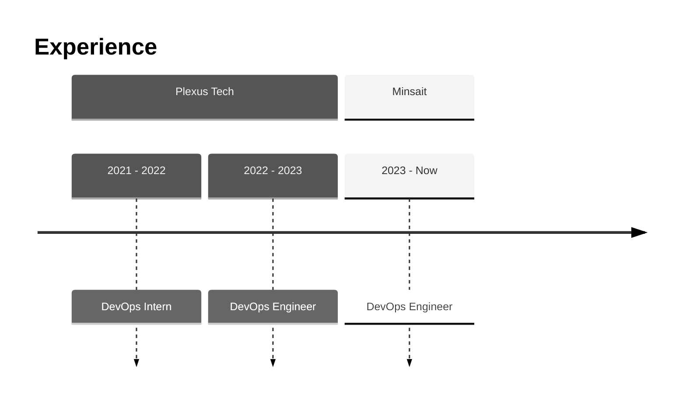

<h1 align="center">Hi 👋, I'm Javier</h1>

  

  

### Connect with me

  

### Languages and Tools

  
  
  
  
  
  
  
  
  
  
  
  
  
  
  
  
  

<h3 align="center">Stars</h3>

    
  

<h3 align="center">Statistics</h3>

  

